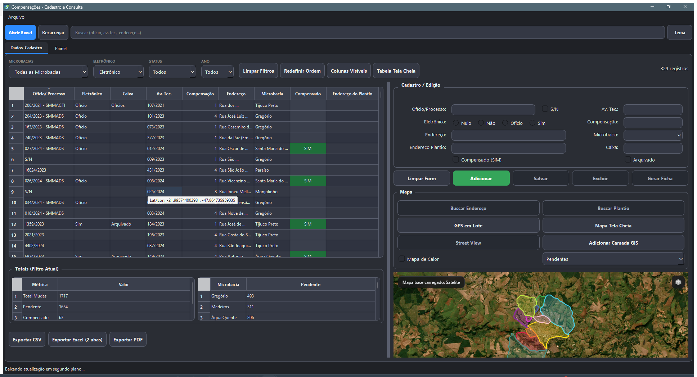
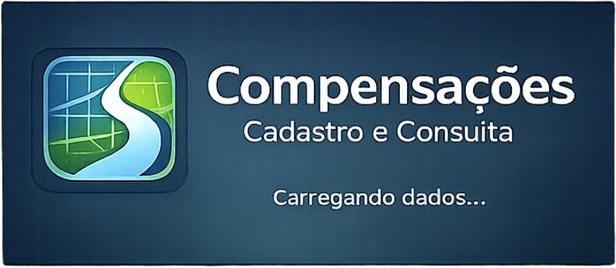

# Compensações

[](https://github.com/DavidWIA2/Compensacoes_app/actions/workflows/windows-ci.yml)
[](https://github.com/DavidWIA2/Compensacoes_app/actions/workflows/windows-release.yml)
[](https://github.com/DavidWIA2/Compensacoes_app/releases/latest)
[](https://www.python.org/)

Aplicativo desktop em Python para cadastro, consulta e acompanhamento de compensações ambientais ligadas à supressão de árvores no município de São Carlos - SP.

O projeto foi evoluído para um fluxo mais completo de operação: leitura e edição de planilhas Excel, filtros e métricas, mapa com apoio geoespacial, exportações em vários formatos, diagnósticos, logs e pipeline de release para distribuição no Windows.

Agora o app tambem tem uma porta de entrada com dois modos:

- `Producao`: acesso autenticado ao ambiente oficial
- `Demonstracao`: base ficticia isolada para testes

## Download

- Última versão publicada: [GitHub Releases](https://github.com/DavidWIA2/Compensacoes_app/releases/latest)
- Pacotes disponíveis: instalador Windows, `.zip`, checksums, notas de release e `latest.json`
- Para distribuição restrita sem assinatura, publique também o `.sha256` e o `verify_release_checksum.ps1`

## Capturas

### Visão geral da aplicação



### Splash screen



## O que o app faz

- Abre uma planilha padrão de compensações e transforma as linhas em registros editáveis.
- Permite cadastrar, alterar, excluir, filtrar e pesquisar registros com interface gráfica.
- Exibe métricas consolidadas, pendências e visão analítica por filtros.
- Trabalha com mapa, microbacias e apoio geoespacial.
- Faz geocodificação em lote para apoiar o preenchimento de coordenadas.
- Exporta dados em `CSV`, `Excel` e `PDF`, incluindo ficha individual e relatório de painel.
- Mantém backups da planilha e permite restaurar versões anteriores.
- Gera logs e diagnóstico para suporte.
- Suporta verificação e instalação automática de atualização via `latest.json` do GitHub Releases quando a release publica instalador `.exe` com `SHA-256`.

## Stack principal

- Python 3.12
- PySide6
- openpyxl
- pandas
- reportlab
- geopandas
- shapely
- pyogrio
- fiona
- pyproj
- requests
- supabase
- PyInstaller
- pytest

## Estrutura do projeto

```text
Compensacoes_app/
|-- app/           Codigo principal da aplicacao
|-- assets/        Icones e recursos visuais
|-- data/          Planilha modelo, microbacias e cache local
|-- docs/          Documentacao de operacao e release
|-- scripts/       Automacoes de validacao, build e release
|-- tests/         Suite automatizada
|-- run.py         Ponto de entrada da aplicacao
|-- README.md
`-- requirements.txt
```

## Planilha modelo

O arquivo de referência está em [data/modelo_planilha_compensacoes.xlsx](data/modelo_planilha_compensacoes.xlsx).

Para o app funcionar corretamente, a estrutura da planilha deve manter os cabeçalhos esperados pelo sistema.

## Como executar localmente

No Windows PowerShell:

```powershell
git clone https://github.com/DavidWIA2/Compensacoes_app.git
cd Compensacoes_app
python -m venv .venv
.\.venv\Scripts\activate
pip install -r requirements.txt
python run.py
```

Se você já usa a venv do projeto em Python 3.12:

```powershell
.\.venv312\Scripts\activate
python run.py
```

## Testes e validação

Rodar a suíte completa:

```powershell
.\.venv312\Scripts\python.exe -m pytest -q
```

Validação rápida do app e do ambiente:

```powershell
.\scripts\validate.ps1 -PythonExe .\.venv312\Scripts\python.exe
```

## Build e distribuição

Build local de release:

```powershell
.\scripts\build_release.ps1 -PythonExe .\.venv312\Scripts\python.exe -Clean
```

O fluxo de release atual gera:

- pacote `.zip`
- checksum `.sha256`
- notas de release
- guia de distribuição
- `latest.json` para o atualizador
- script de verificação de checksum
- script do instalador Inno Setup

Nas builds publicadas, o app consulta por padrão `https://github.com/DavidWIA2/Compensacoes_app/releases/latest/download/latest.json`. A variável `COMPENSACOES_UPDATE_URL` continua disponível para override.

Para detalhes de empacotamento, instalador, publicação e assinatura de código, veja [docs/release.md](docs/release.md).

## Supabase

O repositório já possui a base inicial para evoluir do SQLite local para um
Postgres remoto com Supabase:

- migrations em `supabase/migrations/`
- seed seguro em `supabase/seed.sql`
- script administrativo de carga em `scripts/sync_sqlite_to_supabase.py`

O guia operacional está em [docs/supabase.md](docs/supabase.md).
O roadmap da transição definitiva está em [docs/supabase-transition-plan.md](docs/supabase-transition-plan.md).

## Distribuição sem assinatura

O app pode ser usado normalmente sem assinatura digital, o que é suficiente para uso interno ou distribuição restrita. Nesse cenário, o recomendado é publicar o artefato com o `.sha256` e orientar a validação com:

```powershell
.\verify_release_checksum.ps1 -ArtifactPath .\Compensacoes-vX.Y.Z-win64.zip
```

Para a tela de acesso, o app usa as variaveis publicas abaixo:

```env
COMPENSACOES_SUPABASE_PROD_URL=https://seu-projeto.supabase.co
COMPENSACOES_SUPABASE_PROD_PUBLISHABLE_KEY=sb_publishable_...
```

Se voce quiser uma demonstracao online separada, configure tambem:

```env
COMPENSACOES_SUPABASE_DEMO_URL=https://seu-projeto-demo.supabase.co
COMPENSACOES_SUPABASE_DEMO_PUBLISHABLE_KEY=sb_publishable_...
```

Sem um projeto demo configurado, o app continua oferecendo demonstracao com uma base local ficticia, reiniciada a cada abertura.

## Releases

As versões publicadas ficam em [GitHub Releases](https://github.com/DavidWIA2/Compensacoes_app/releases).

## Autor

David Wiliam Pinheiro de Oliveira
